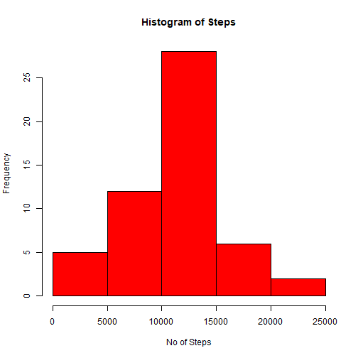
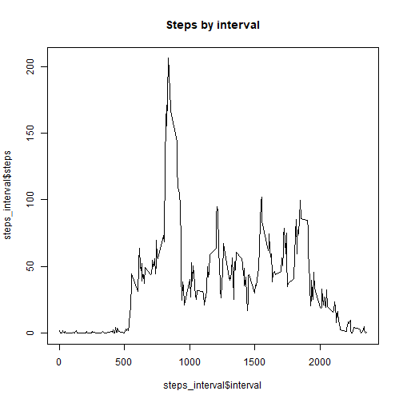
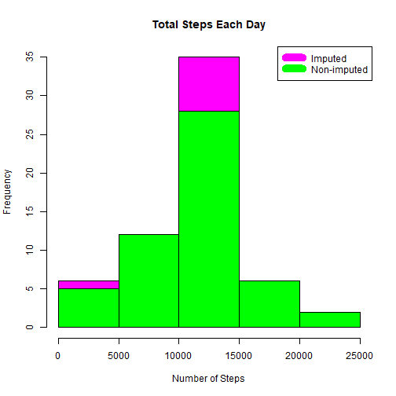
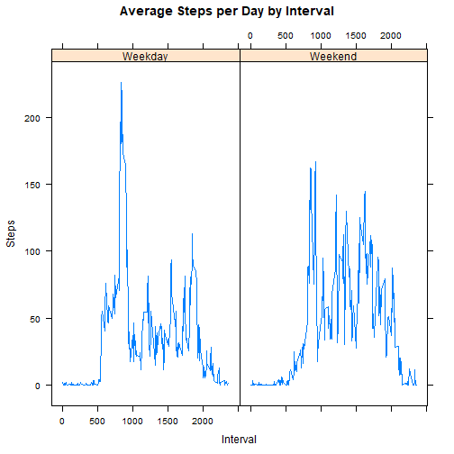

Coursera Data Science Specialization  
====================================
---
author:* "Yash Gupta" *
---
## Reproducible Research
### Course Project 1  

1. To read the data into a data.frame

```r
dat<-read.csv("activity.csv")
summary(dat)
```

```
##      steps                date          interval     
##  Min.   :  0.00   2012-10-01:  288   Min.   :   0.0  
##  1st Qu.:  0.00   2012-10-02:  288   1st Qu.: 588.8  
##  Median :  0.00   2012-10-03:  288   Median :1177.5  
##  Mean   : 37.38   2012-10-04:  288   Mean   :1177.5  
##  3rd Qu.: 12.00   2012-10-05:  288   3rd Qu.:1766.2  
##  Max.   :806.00   2012-10-06:  288   Max.   :2355.0  
##  NA's   :2304     (Other)   :15840
```

2.
* Calculate the total number of steps taken per day  
* Make a histogram of the total number of steps taken each day  
* Calculate and report the mean and median of the total number of steps taken per day


```r
TotalSteps <- aggregate(steps~date,dat,sum)
hist(TotalSteps$steps,xlab="No of Steps",col="red",main="Histogram of Steps")
```



The mean of steps per day for all the dates is `Mean_Steps_Old`.  

```r
Mean_Steps_Old<-mean(TotalSteps$steps)
Mean_Steps_Old
```

```
## [1] 10766.19
```

The median of steps per day for all the dates is `Median_Steps_Old`.

```r
Median_Steps_Old<-median(TotalSteps$steps)
Median_Steps_Old
```

```
## [1] 10765
```

3. Understanding the average daily pattern
* Make a time series plot
* Obtain the maximum value of number of steps


```r
steps_interval <- aggregate(steps ~ interval, dat, mean)
plot(x=steps_interval$interval,y=steps_interval$steps,type='l',main='Steps by interval')
```



The maximum value of step is

```
## [1] 835
```

4.
* Calculate and report the total number of missing values in the dataset (i.e. the total number of rows with NAs)  


```r
sum(!complete.cases(dat))
```

```
## [1] 2304
```

* Devise a strategy for filling in all of the missing values in the dataset. Used the mean/median for that day, or the mean for that 5-minute interval.

```r
imputed_data <- transform(dat,
                          steps = ifelse(is.na(dat$steps),
                                         steps_interval$steps[match(dat$interval, steps_interval$interval)],
                                         dat$steps))
imputed_data[as.character(imputed_data$date) == "2012-10-01", 1] <- 0
```

* Create a new dataset that is equal to the original dataset but with the missing data filled in.

```r
steps_by_day_i <- aggregate(steps ~ date, imputed_data, sum)
```
* Make a histogram of the total number of steps taken each day and Calculate and report the mean and median total number of steps taken per day. 


```r
hist(steps_by_day_i$steps, main = paste("Total Steps Each Day"), col="magenta", xlab="Number of Steps")

hist(TotalSteps$steps, main = paste("Total Steps Each Day"), col="green", xlab="Number of Steps", add=T)
legend("topright", c("Imputed", "Non-imputed"), col=c("magenta", "green"), lwd=10)
```



The new mean for the steps is `Mean_Steps_new`.

```r
Mean_Steps_New <- mean(steps_by_day_i$steps)
Mean_Steps_New
```

```
## [1] 10589.69
```

The new median for the steps is `Median_Steps_new`.

```r
Median_Steps_New <- median(steps_by_day_i$steps)
Median_Steps_New
```

```
## [1] 10766.19
```

The difference between both the means is

```r
Mean_Steps_New-Mean_Steps_Old
```

```
## [1] -176.4949
```

The difference between both the median is

```r
Median_Steps_New-Median_Steps_Old
```

```
## [1] 1.188679
```


5. 
* Create a new factor variable in the dataset with two levels - "weekday" and "weekend" indicating whether a given date is a weekday or weekend day

```r
weekdays <- c("Monday", "Tuesday", "Wednesday", "Thursday", 
              "Friday")
imputed_data$dow = as.factor(ifelse(is.element(weekdays(as.Date(imputed_data$date)),weekdays), "Weekday", "Weekend"))
```

* Panel plot to note the changes

```r
steps_by_interval_i <- aggregate(steps ~ interval + dow, imputed_data, mean)

library(lattice)

xyplot(steps_by_interval_i$steps ~ steps_by_interval_i$interval|steps_by_interval_i$dow, main="Average Steps per Day by Interval",xlab="Interval", ylab="Steps",layout=c(2,1), type="l")
```


